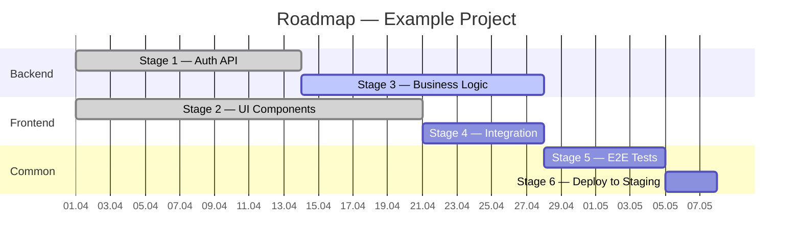

# Corporate Standard for AI-Assisted Development

**Status:** Beta
**Version:** 0.9
**Date:** 2026-03-19
**Owner:** AI Implementation Department

---

## 1. Purpose and Philosophy

The standard describes the mandatory process for product development using AI tools.

**Key philosophy:**
> We apply the best development practices established by the industry. AI acts as an executor — it replaces the human coder but does not replace engineering culture, architectural thinking, and specialist accountability. Thorough documentation elaboration, rigorous testing, and code quality remain the foundation — regardless of who writes the code: human or AI.

**Scope:**
- All company projects (phased rollout — see section 18)
- All development process participants: developers, architects, system analysts, business analysts, QA, DevOps, support
- Technology stack is not restricted

---

## 2. Project Classification

The project level determines the list of permitted AI tools, mandatory security rules, and the set of files from the corporate repository.

| Level | Name | Data | Permitted AI Tools |
|-------|------|------|--------------------|
| **L1** | Public / Internal | No sensitive data, internal tools | All approved tools |
| **L2** | Confidential | Corporate information | All approved tools |
| **L3** | Restricted | PII, financial data, medical data, trade secrets, compliance-regulated | Self-hosted LLM only, deployed within the company perimeter |

> The project level is determined at initialization and recorded in the project's `AI_RULES.md`.

---

## 3. AI Tools Registry

### 3.1 Chat Tools

| Tool | Purpose | Levels |
|------|---------|--------|
| Public LLMs (ChatGPT, Claude, Gemini, etc.) | Analysis, research, brainstorming, document work | L1, L2 |
| Self-hosted LLMs (Ollama, Llama, Mistral, etc.) | All tasks for restricted projects | L1, L2, L3 |

### 3.2 IDE and Development Tools

| Tool | Usage Type | When to Use | Levels |
|------|-----------|-------------|--------|
| **High-level orchestrators** (Aperant, Paperclip, etc.) | Autonomous high-level development | **Mandatory for new projects.** Initialization, roadmap, parallel agent tasks. Pipeline: Orchestrator → Coder → QA via isolated git worktrees | L1, L2 |
| **AI-powered IDEs** (Cursor, Windsurf, etc.) | Targeted development with codebase context | Feature implementation, refactoring | L1, L2 |
| **CLI agents** (Claude Code, Codex, etc.) | Targeted development, CLI tasks | Executing roadmap tasks, code review, debugging | L1, L2 |
| **Self-hosted AI** | All tasks | For L3 projects — self-hosted alternatives for all levels | L1, L2, L3 |

### 3.3 Tool Selection Principle

```
Tool hierarchy:

Level 1 — Orchestrator (Aperant, Paperclip, etc.)
  └── Level 2 — AI-powered IDE (Cursor, Windsurf, etc.)
        └── Level 3 — CLI agent (Claude Code, Codex, etc.)

Entry point selection:
New project / large-scale task / autonomy needed    →  Orchestrator (mandatory for new projects)
Targeted task / file context needed                  →  AI-powered IDE / CLI agent
Analysis / consultation / documentation              →  Chat tools (ChatGPT / Claude web)
L3 project                                           →  self-hosted alternatives only for all levels
```

---

## 4. Corporate AI Configuration Repository

All corporate skills, subagents, hooks, and rules are stored in a **central repository** (`company-ai-toolkit`). Projects import the necessary files during initialization.

Detailed repository structure — see **Appendix F**.

### 4.1 How It Works

```
company-ai-toolkit/                  ← corporate repository
├── skills/                          ← reusable workflows
├── agents/                          ← specialized subagents
├── hooks/                           ← deterministic automation
├── rules/                           ← rules by file types
├── mcp/                             ← MCP configs by levels
└── registry.md                      ← registry: what is mandatory, what is optional
```

### 4.2 File Requirements

Each file in the repository is marked with two attributes:

| Attribute | Values | Description |
|-----------|--------|-------------|
| **Project level** | `L1`, `L2`, `L3`, `all` | At which level the file is mandatory |
| **Project type** | `frontend`, `backend`, `fullstack`, `mobile`, `data`, `infra`, `all` | For which project type the file is mandatory |

Marks are set in the YAML frontmatter of each file:

```yaml
---
required-for:
  levels: [all]
  types: [backend, fullstack]
---
```

### 4.3 Integration and Updates in Projects

The repository is connected as a **git submodule** in `.ai/toolkit`. This ensures versioning and controlled updates.

**During project initialization:**
1. Determine the level (L1/L2/L3) and project type (frontend/backend/etc.)
2. Add the submodule and pin it to a specific version tag
3. Run `import.sh` — the script will copy the necessary files to `.ai/`
4. Commit to Git

**Toolkit updates in projects:**
- PATCH/MINOR — via automatic MR from CI bot (weekly)
- MAJOR — manually with team review

The repository uses SemVer. MAJOR updates are mandatory; the deadline is set by the AI Implementation Department.

Detailed instructions — see **Appendix F**.

---

## 5. Development Process (AI-Assisted SDLC)

**Key principle:**
> AI is driven by documentation. Product quality is directly proportional to documentation quality. Poor documentation → poor product, regardless of AI quality.

All documentation is maintained **synchronously in two places**:
- MD files in the project repository (used by AI tools)
- Official documents in the **corporate knowledge base** (Confluence, Notion, BookStack, etc. — via MCP integration)

AI and the specialist work together with MCP — changes in MD are synchronized with the knowledge base.

**Source of truth and synchronization:**
- MD files in the git repository are the single source of truth
- The knowledge base **must** be in sync with git at all times
- Every MD file change must be synchronized to the knowledge base via MCP
- Divergence between git and the knowledge base is an incident that must be resolved
- When divergence is detected, the git version is authoritative; the knowledge base is overwritten

**Graceful degradation when knowledge base is unavailable:**
- Knowledge base unavailability **does not block** work — development continues using MD files in git
- Failed synchronization is recorded as a task with the `docs-sync` label in the tracker
- After access is restored — batch synchronization of all changed MD files
- A CI task checks for divergences weekly and creates an alert if found

**Process structure:**

| Type | Phases | Description |
|------|--------|-------------|
| **Main cycle** | Phases 1–4 | Sequential chain: documentation → roadmap → approval → development. Applied when creating a new project and when adding each new feature. |
| **Parallel processes** | Phases 5–7 | Triggered by event: incoming request (5), bug discovery (6), refactoring decision (7). Run independently of the main cycle. |

### Task Classification by Required Stages

| Task Type | Description | Required Phase 1 Stages | Example |
|-----------|-------------|-------------------------|---------|
| **Business feature** | New functionality affecting business logic | All 6 stages (BA → SA → Arch → QA → DevOps → Dev) | New payment module, external service integration |
| **Technical task** | Change not affecting business functionality | Arch → Dev → QA | Refactoring, tech debt, dependency updates, optimization |
| **Bugfix** | Defect correction | QA → Dev (+ owners of affected MD files as needed) | See Phase 6 |

> **Principle:** business determines what is needed — therefore, for any functionality affecting business logic, passing through all roles is mandatory. Technical tasks that don't change system behavior for the user follow a shortened chain.

The depth of elaboration is proportional to the scale of the change.

**SLA for inter-role interactions:**

| Action | Deadline |
|--------|----------|
| Response to a comment on your MD file | 1 business day |
| Documentation approval (Phase 3) | 2 business days |
| Applying corrections after a comment | 2 business days |
| Escalation if no response | Department head |

> SLAs can be adapted for specific projects in agreement with the AI Implementation Department.

---

### 5.1 Documentation Ownership

**Single owner principle:** each MD file has one owner — a specialist of the corresponding role. Only the owner has the right to edit their file.

**Substitution:** each owner must have a designated substitute — a specialist of the same or adjacent role who takes responsibility in case of the owner's absence (vacation, illness). The substitute is recorded in `docs/OWNERS.md`. In the owner's absence, the substitute receives full editing rights for the files.

| Owner | Artifacts (files) | Rights |
|-------|-------------------|--------|
| **Business Analyst** | `docs/business/requirements.md`, `docs/business/user-stories.md` | Sole creator and editor |
| **System Analyst** | `docs/sa/functional-requirements.md`, `docs/sa/non-functional-requirements.md`, `docs/sa/data-model.md` | Sole creator and editor |
| **Architect** | `docs/architecture/overview.md`, `docs/architecture/adr/*` | Sole creator and editor |
| **QA Lead** | `docs/qa/test-strategy.md`, `docs/qa/acceptance-criteria.md` | Sole creator and editor |
| **DevOps Lead** | `docs/devops/deployment.md`, `docs/devops/infrastructure.md` | Sole creator and editor |
| **Developer** | `docs/dev/technical-notes.md` | Sole creator and editor |

**If another role discovers a problem in someone else's file** — they create a comment (issue in the tracker / comment in the knowledge base) but do not edit the file directly. The owner makes changes independently.

**Exception:** The Developer at stage 1.6 may propose edits to all files, but each edit is approved by the file owner.

### 5.2 Role Consolidation for Small Teams

For teams of 3–5 people, role consolidation is allowed. Below is the permitted consolidation matrix.

**Principle:** roles that review each other **are not consolidated** (writer ≠ reviewer).

| Role | May consolidate with | Cannot consolidate with | Rationale |
|------|---------------------|------------------------|-----------|
| **Business Analyst** | System Analyst | QA Lead | BA and SA work sequentially on the same data; BA + QA = conflict of interest (writes requirements and accepts them) |
| **System Analyst** | Business Analyst | Architect | SA + Arch: one person both describes requirements and makes architectural decisions — no challenge |
| **Architect** | DevOps Lead | System Analyst | Arch + DevOps: both work at the infrastructure and technology level |
| **QA Lead** | — | BA, Developer | QA must be independent from the requirements author and code author |
| **DevOps Lead** | Architect | — | DevOps + Arch — natural consolidation |
| **Developer** | — | QA Lead | Writer ≠ Reviewer |

**Minimum team examples:**

| Size | Distribution |
|------|-------------|
| **3 people** | (1) BA + SA, (2) Arch + DevOps + Dev, (3) QA Lead |
| **4 people** | (1) BA + SA, (2) Arch + DevOps, (3) Dev, (4) QA Lead |
| **5 people** | (1) BA, (2) SA, (3) Arch + DevOps, (4) Dev, (5) QA Lead |

> **QA Lead is not consolidated** with anyone in minimum configurations — this is a deliberate decision. QA independence from development and requirements authors is the foundation of quality.

---

### Phase 1 — Documentation Elaboration Through AI Dialogue

**Applied:** when creating a new project and when adding a new feature.

**Work format:** the specialist conducts an interview-dialogue with AI in the corresponding role. AI asks clarifying questions, the specialist answers. The result of each dialogue is the creation or update of MD files. The specialist-owner is responsible for the quality of the MD file.

Each stage concludes with a review and handoff to the next stage. Prompt templates for each role — see **Appendix B**.

#### New Project vs. New Feature

| Aspect | New Project | New Feature |
|--------|------------|------------|
| Artifacts | Created from scratch | Existing files updated |
| Elaboration scope | Full | Proportional to feature scope |
| Role chain | All 6 stages mandatory | Per task classification (see above) |
| ROADMAP | Created new | Updated — new stage added |
| Documentation | New MD files | New sections or child files |

#### 1.1 Business Analyst + AI
**Owner:** Business Analyst
**Artifacts:** `docs/business/requirements.md`, `docs/business/user-stories.md`
**Focus:**
- What problem does the product / feature solve?
- Who are the target users and their scenarios?
- Success criteria, MVP boundaries / feature scope

#### 1.2 System Analyst + AI
**Owner:** System Analyst
**Artifacts:** `docs/sa/functional-requirements.md`, `docs/sa/non-functional-requirements.md`, `docs/sa/data-model.md`
**Focus:**
- System integrations
- Performance, security, scalability requirements
- Constraints and dependencies

#### 1.3 Architect + AI
**Owner:** Architect
**Artifacts:** `docs/architecture/overview.md`, `docs/architecture/adr/`
**Focus:**
- Architecture and technology stack (for features — impact on existing architecture)
- Architecture Decision Records (ADR) with trade-off rationale
- Architectural risks

#### 1.4 QA Lead + AI
**Owner:** QA Lead
**Artifacts:** `docs/qa/test-strategy.md`, `docs/qa/acceptance-criteria.md`
**Focus:**
- Testing strategy (for features — supplement to existing strategy)
- Acceptance criteria for each requirement
- Testing priorities

#### 1.5 DevOps Lead + AI
**Owner:** DevOps Lead
**Artifacts:** `docs/devops/deployment.md`, `docs/devops/infrastructure.md`
**Focus:**
- CI/CD strategy (for features — impact on existing pipeline)
- Environments (dev / staging / prod)
- Monitoring and alerting

#### 1.6 Developer + AI
**Owner:** Developer (for `docs/dev/technical-notes.md`)
**Artifacts:** final version of all MD files, `docs/dev/technical-notes.md`
**Focus:**
- Feasibility within the chosen stack
- Identifying contradictions between requirements from different roles
- Proposing edits to all MD files → **each edit is approved by the file owner**

---

### Phase 2 — Roadmap Construction / Update

After documentation is complete — build or update the roadmap using an orchestrator (Aperant, Paperclip, etc.) or CLI agent (Claude Code, etc.) based on the completed MD files.

- **New project:** create `ROADMAP.md` with breakdown into stages, tasks, and completion criteria for each stage.
- **New feature:** update `ROADMAP.md` — add a new stage with tasks and completion criteria.

#### Roadmap Format Selection

| Project Scale | Format | When to Use |
|--------------|--------|-------------|
| **Small** (up to 1 month of development) | Flat list of stages | Project with linear task sequence, 1–3 developers |
| **Medium and large** (over 1 month) | Structured with dependencies and Gantt chart | Parallel work streams, multiple teams, complex dependencies |

#### ROADMAP.md Template — Small Project

```markdown
# Roadmap — [project name]

**Last updated:** YYYY-MM-DD
**Status:** In Progress / Completed

## Stage 1 — [name]
**Timeline:** YYYY-MM-DD → YYYY-MM-DD
**Status:** ✅ Done / 🔄 In Progress / ⏳ Pending

Tasks:
- [ ] Task 1.1 — brief description
- [ ] Task 1.2 — brief description
- [ ] Task 1.3 — brief description

Completion criteria:
- [ ] All tests pass
- [ ] Code review passed
- [ ] Merged to dev

## Stage 2 — [name]
...
```

#### ROADMAP.md Template — Medium and Large Project

```markdown
# Roadmap — [project name]

**Last updated:** YYYY-MM-DD
**Status:** In Progress / Completed
**Team:** [number of people, key roles]

## Stage Overview

| # | Stage | Timeline | Depends on | Assignee | Status |
|---|-------|----------|-----------|----------|--------|
| 1 | [name] | W1–W2 | — | @developer1 | ✅ Done |
| 2 | [name] | W1–W3 | — | @developer2 | 🔄 In Progress |
| 3 | [name] | W3–W4 | Stage 1, Stage 2 | @developer1 | ⏳ Blocked |
| 4 | [name] | W4–W5 | Stage 3 | @developer2 | ⏳ Pending |

## Gantt Chart

[mermaid chart — see example below outside the template]

## Stage Details

### Stage 1 — [name]
**Timeline:** YYYY-MM-DD → YYYY-MM-DD
**Depends on:** —
**Blocks:** Stage 3
**Assignee:** @developer1
**Status:** ✅ Done

Tasks:
- [x] Task 1.1 — brief description
- [x] Task 1.2 — brief description
- [x] Task 1.3 — brief description

Completion criteria:
- [x] All tests pass
- [x] Code review passed
- [x] Merged to dev
- [x] API documented

### Stage 2 — [name]
...

## Risks and Dependencies

| Risk | Probability | Impact | Mitigation |
|------|------------|--------|-----------|
| [description] | High / Medium / Low | [affected stages] | [action plan] |

## Change History

| Date | Change | Reason |
|------|--------|--------|
| YYYY-MM-DD | Added stage N | New feature [name] |
```

**Mermaid Gantt chart example** (inserted in the "Gantt Chart" section of the template above):



> **Mermaid** is rendered in GitHub, GitLab, and most IDEs. If the tool does not support mermaid, the chart remains as a textual description of dependencies in the "Stage Overview" table.

---

### Phase 3 — Documentation Approval Review

Mandatory approval before development starts. Review checklist — see **Appendix C**.

#### 3.1 AI-Generated Documentation Verification

Documentation created in dialogue with AI during Phase 1 undergoes automatic verification in the git pipeline before the approval review:

```
1. Cross-validation     → AI in a fresh session checks consistency of all MD files with each other
2. Completeness check   → AI checks for all mandatory sections per template
3. Fact-check           → Flags specific claims requiring human confirmation
                          (numerical metrics, SLAs, limitations, system names)
4. Report               → Verification report is generated and attached to the MR
```

> **Writer/Reviewer principle:** verification is performed by AI in a separate session from the one where the documentation was created. A fresh context ensures objectivity. Verifier prompt — see **Appendix B (AI Documentation Verifier)**.

#### 3.2 Human Approval Review

| Role | What is reviewed |
|------|-----------------|
| Architect | Architectural decisions, technology stack, ADR |
| Developer | Feasibility, completeness of technical requirements |
| QA | Completeness of acceptance criteria, testability of requirements |

**Development starts only with Approved from all three roles.**

---

### Phase 4 — Development and Review

1. Select a tool according to section 3.3
2. Import mandatory files from the corporate repository (section 4)
3. Connect mandatory MCP servers — see **Appendix D**
4. Develop by `ROADMAP.md` stages strictly following TDD
5. Before each significant task — **Plan Mode**: Explore → Plan → Implement → Verify

**Mandatory workflow for each task:**
```
1. Plan Mode (read-only)   → explore code, create plan
2. Plan approval           → developer reviews the plan
3. TDD                     → tests → implementation → refactoring
4. Verify                  → run tests, check results
```

**After completing each Roadmap stage** — mandatory MR pipeline:

```
1. AI code review          → automatic comments (Writer/Reviewer: fresh session)
2. Auto-fix                → AI addresses comments
3. Test run                → all tests must pass
4. Human review            → final approval by developer
5. Merge to dev branch
6. Update status in ROADMAP.md
```

**Writer/Reviewer pattern:** AI code review is performed in a **separate session** from the development session. A fresh context ensures objectivity — AI is not biased toward code it wrote itself.

**CI/CD integration:** AI code review can be automated in the MR pipeline via CLI AI agent in non-interactive mode (see **Appendix G**).

MRs without passing tests are not accepted for human review.

---

### Phase 5 — Support and Incoming Requests

Support is the entry point for external requests from clients and users.

**Process:**

```
Client reports a problem
        │
        ▼
Support describes the problem and creates an issue in the tracker
        │
        ▼
Support determines criticality
        │
        ├── CRITICAL (production down, blocker)
        │         │
        │         ▼
        │   Issue is directly assigned to Developer
        │   (expedited process, see Phase 6 → Hotfix)
        │
        └── NORMAL (does not block operations)
                  │
                  ▼
            Issue is assigned to QA
                  │
                  ▼
            QA analyzes and routes
            (continues per Phase 6 process)
```

**Requirements for support issues:**
- Steps to reproduce
- Expected behavior
- Actual behavior
- Environment (browser, version, OS)
- Criticality: CRITICAL / NORMAL
- Screenshots / logs if available

Support prompt template — see **Appendix B (Support)**. Task lifecycle in the tracker — see **section 12**.

---

### Phase 6 — Bug Fixing Process

A bug can be discovered at any stage: in dev, staging, or production. The bugfix process differs from the new feature process in that the initiator is QA, not BA.

**Principle:** a bug may be a symptom of a code error, or it may be a consequence of an error in requirements, architecture, or acceptance criteria. QA determines the root cause and routes the fix.

#### Process Diagram

```
QA discovers a bug
        │
        ▼
QA analyzes: are MD file edits needed?
        │
        ├── YES → determines which files are affected
        │         │
        │         ▼
        │   Sends a comment to the file owner
        │         │
        │         ▼
        │   Owner edits their MD file (with AI)
        │         │
        │         ▼
        │   Handoff through the chain: SA → Arch → QA → DevOps → Dev
        │   (only affected roles, not necessarily all)
        │         │
        │         ▼
        │   Approval review of changed files
        │         │
        │         ▼
        │   Developer fixes the bug via TDD
        │
        ├── NO → assigns to Developer directly
        │         │
        │         ▼
        │   Developer analyzes the bug
        │         │
        │         ├── Discovers MD edits are needed → returns to file owner
        │         │
        │         └── No edits needed → fixes via TDD
        │
        ▼
  MR pipeline (AI review → auto-fix → tests → human review → merge)
```

#### Rules

1. **QA is the entry point.** All bugs are recorded by QA in the tracker with description: steps to reproduce, expected behavior, actual behavior.

2. **QA determines the route.** QA analyzes together with AI:
   - Bug in implementation (code doesn't match requirements) → assign to Developer
   - Bug in requirements (requirements are incomplete or incorrect) → assign to the owner of the corresponding MD file
   - Bug in acceptance criteria (criteria don't cover the case) → QA fixes their own file

3. **MD edits only by the owner.** If a bug is caused by an error in `docs/sa/`, only the System Analyst makes the edits. No one else edits others' files.

4. **Partial chain.** For bugfixes, it's not necessary to go through all 6 roles. The chain starts from the role-owner of the affected file and goes to the Developer, involving only those whose files need updating.

5. **Developer can escalate.** If during the fix, the developer discovers the bug is deeper than expected and requires MD file edits — they create a comment for the file owner. Work is paused until edits are made.

6. **TDD for bugfixes is mandatory.** First — a failing test reproducing the bug. Then — the fix. Then — refactoring.

7. **MR pipeline unchanged.** A bugfix goes through the same MR pipeline as any code: AI review → auto-fix → tests → human review.

#### Hotfix (CRITICAL)

For critical issues (production down) — expedited process:

1. Issue from support goes **directly to the Developer**, bypassing QA analysis
2. Developer fixes via TDD: failing test → fix → refactor
3. MR pipeline is mandatory (no exceptions)
4. Branch: `hotfix/*` → merge to `main` and `dev`
5. **After deployment** — mandatory retrospective pass:
   - QA checks: are acceptance criteria edits needed?
   - If the bug revealed a documentation gap — the role chain is triggered after the fact

> A hotfix does not exempt from documentation. It only allows fixing production first, then updating MD files.

---

### Phase 7 — Refactoring and Technical Debt

Planned refactoring is initiated by the Developer or Architect.

**Process:**

```
Developer / Architect creates an issue with refactoring justification
        │
        ▼
Architect + AI — assess impact on architecture
(if refactoring affects architecture — update ADR)
        │
        ▼
Developer performs refactoring via TDD
        │
        ▼
QA — verify refactoring didn't break existing tests
        │
        ▼
MR pipeline (AI review → tests → human review → merge)
```

**Rules:**
- Role chain for refactoring: **Architect → Developer → QA**
- BA, SA, DevOps are involved only if refactoring affects their artifacts
- Refactoring must not change system behavior — only internal structure
- All existing tests must pass without changes (except when interfaces are modified)

---

## 6. Legacy Project Adaptation

Legacy projects are adapted to the standard **incrementally**.

### Stage 1 — Immediately

- Connect mandatory MCP servers (Appendix D)
- Insert the mandatory rule block in `AI_RULES.md` (Appendix A)
- Connect the repository as a git submodule and import mandatory skills, agents, hooks (Appendix F)
- Use AI tools in day-to-day development

### Stage 2 — Within the First Quarter

- Create the `docs/` structure and begin populating MD files
- Every new feature and every bugfix follows the full process (Standard Phases 1–4)
- Documentation gradually accumulates, covering existing functionality

### Stage 3 — Full Integration

- All MD files are populated for key functionality
- The project fully operates according to the standard
- Orchestrator (Aperant, Paperclip, etc.) is used for large tasks

> The adaptation pace is determined by the project team together with the AI Implementation Department. The key point — **every new change already follows the standard**, retrospective documentation is filled in parallel.

---

## 7. Git Flow

Mandatory branching strategy for all projects:

```
main          ← production releases only
└── release/* ← release candidates
└── dev        ← main development branch
    └── feature/*  ← new functionality
    └── fix/*      ← fixes
    └── hotfix/*   ← urgent fixes to main
```

---

## 8. Testing

### 8.1 Mandatory Testing Levels

| Type | Mandatory | Exceptions |
|------|-----------|-----------|
| Unit | Yes | — |
| Integration | Yes | — |
| E2E | Yes | — |
| Performance / Load | Yes | — |
| Security (SAST/DAST) | Yes | — |

### 8.2 Coverage

- **Minimum 80%** for all code
- **CRUD operations** — exception from the threshold requirement

### 8.3 TDD — Mandatory Pattern

**All new features and fixes are written strictly following the Red → Green → Refactor cycle.**

```
Cycle:
1. Write a failing test based on acceptance criteria (Red)
2. Write minimal implementation to pass the test (Green)
3. Refactor without breaking tests (Refactor)
```

**Working with AI in TDD:**
1. Pass AI the acceptance criteria from `docs/qa/acceptance-criteria.md`
2. Ask to write tests → verify tests fail (Red)
3. Ask to write minimal implementation (Green)
4. Refactor together with AI (Refactor)

PRs without tests for new functionality are rejected without review.

---

## 9. AI Context Management

The context window is a key resource. When it fills up, AI quality degrades.

### 9.1 Mandatory Rules

- `/clear` between unrelated tasks — context reset
- Subagents for codebase investigation — don't pollute the main context
- After 2 failed corrections — `/clear` and a new prompt accounting for errors
- `AI_RULES.md` up to 200 lines. Details go into `@imports` and `.ai/rules/`
- Use MCP servers for targeted data instead of raw output: code navigation, library documentation, git diffs, tracker and knowledge base integration

### 9.2 Anti-patterns

| Anti-pattern | Symptom | Solution |
|-------------|---------|---------|
| Kitchen sink session | Unrelated tasks in one session | `/clear` between tasks |
| Endless correction | 3+ fixes for the same error | `/clear` + new prompt |
| Bloated AI_RULES.md | AI ignores rules | Trim, move to rules/skills |
| Trust-then-verify gap | Code looks good but doesn't work | Always verify: tests, screenshots |
| Endless exploration | AI reads hundreds of files | Limit scope or use subagents |

---

## 10. Mandatory Project Rules

Every project must contain:
- **`AI_RULES.md`** — mandatory block of corporate rules (see **Appendix A**) + project-specific rules. Maximum 200 lines, details via `@imports`.
- **`.mcp.json`** — MCP server configuration by project level (see **Appendix D**)
- **`.ai/skills/`** — mandatory skills from the corporate repository (see **Appendix F**)
- **`.ai/agents/`** — mandatory subagents from the corporate repository (see **Appendix F**)
- **`.ai/settings.json`** — mandatory hooks (see **Appendix F**)
- **`.ai/rules/`** — rules by file types from the corporate repository (see **Appendix F**)

> **Mapping to specific tools:** `AI_RULES.md` is translated to the specific tool's format during project initialization (e.g., `CLAUDE.md` for Claude Code, `.cursorrules` for Cursor). The `.ai/` directory is similarly mapped to `.claude/`, `.cursor/`, etc. The `import.sh` script performs the translation automatically.

For **L3 (Restricted)** projects, extended security rules additionally apply:

```markdown
## Security Rules — L3 Restricted
- ONLY use self-hosted LLM within company perimeter
- Never send any project data to external AI services
- SAST scan must pass before any MR is accepted
- Report any discovered vulnerability immediately, before proceeding
```

Full list of security policies — see **Appendix E**.

---

## 11. Mandatory Project Structure

```
project-root/
├── AI_RULES.md                      # AI rules (≤200 lines, @imports for details)
├── ROADMAP.md                       # Development roadmap
├── .mcp.json                        # MCP server config (Appendix D)
├── .ai/
│   ├── settings.json                # Hooks and permissions
│   ├── skills/
│   │   ├── fix-issue/SKILL.md       # Workflow: issue → fix → test → PR
│   │   ├── security-review/SKILL.md # Workflow: security code review
│   │   └── code-review/SKILL.md     # Workflow: code review by checklist
│   ├── agents/
│   │   ├── security-reviewer.md     # Subagent: security check
│   │   └── code-reviewer.md         # Subagent: code quality check
│   └── rules/
│       ├── security.md              # Security rules (all files)
│       ├── tests.md                 # Testing rules (*.test.*)
│       └── api.md                   # API rules (src/api/**)
├── docs/
│   ├── business/
│   │   ├── requirements.md
│   │   └── user-stories.md
│   ├── sa/
│   │   ├── functional-requirements.md
│   │   ├── non-functional-requirements.md
│   │   └── data-model.md
│   ├── architecture/
│   │   ├── overview.md
│   │   └── adr/
│   ├── qa/
│   │   ├── test-strategy.md
│   │   └── acceptance-criteria.md
│   ├── dev/
│   │   └── technical-notes.md
│   └── devops/
│       ├── deployment.md
│       └── infrastructure.md
```

---

## 12. Task Lifecycle (Issue Lifecycle)

All tasks, bugs, and features are tracked in a **task tracker** (Jira, Linear, YouTrack, etc.). Mandatory statuses:

| Status | Description |
|--------|-------------|
| **Open** | Task recorded, not yet picked up |
| **In Analysis** | QA or developer is analyzing the task, routing |
| **In Documentation** | MD file update by the role owner |
| **Awaiting Approval** | Documentation sent for approval review (Phase 3) |
| **In Progress** | Development in progress following TDD |
| **In Review** | MR created, undergoing AI review + human review |
| **Done** | Merge completed, task closed |
| **Blocked** | Task blocked — dependency or awaiting decision |

**Rules:**
- Each status transition is accompanied by a comment in the tracker with justification
- **Blocked** status requires specifying the blocker in a comment
- Bugs from support are created with the `bug` label and `CRITICAL` / `NORMAL` priority
- Hotfix tasks are created with the `hotfix` label and automatically receive `CRITICAL` priority
- After hotfix deployment, the developer closes the task and creates a new task with the `docs-debt` label if retrospective documentation is needed

---

## 13. Metrics

Mandatory metrics for all projects. Collection and analysis is the responsibility of the AI Implementation Department.

**Collection tool:** task tracker (primary data source for process and quality metrics).

| Category | Metric | Source | Target Range |
|----------|--------|--------|-------------|
| **Speed** | Time from task creation to Done status | Tracker: cycle time | 1–5 days (task), 1–3 weeks (feature). Track trend — 10–20% reduction per quarter |
| **Speed** | Time from idea to first working build | Tracker: epic lead time | Depends on scale. Establish baseline during pilot, then track trend |
| **Quality** | Number of production bugs (`bug` + `production` labels) | Tracker: filter | 15–30% reduction per quarter relative to baseline. CRITICAL bugs: aim for 0 |
| **Quality** | Test coverage (target: ≥80% excluding CRUD) | CI/CD report | ≥80%. For critical modules (auth, payments) — ≥90% |
| **Economics** | Token cost / AI tool expenses per project | AI tool dashboard | Within established monthly limit (section 14.1). Cost per task — track trend |
| **Process** | % MRs passing without human comments after AI review | Appendix G metrics | 40–60% at start, target growth to 70–80% over 2–3 quarters |
| **Process** | Average iterations until Approved | Tracker: review comments | 1–3 iterations. More than 3 — signal of documentation or task understanding issues |
| **Documentation** | % projects with complete MD file set before start | Tracker: filter by Awaiting Approval status | 100% for new projects. Legacy — 20–30% growth per quarter until full coverage |

> **Target ranges** are recommended benchmarks. Specific values are refined based on pilot results (section 18, stage 1) and set individually for each project. Baseline is measured in the first month, then trends are tracked.

---

## 14. AI Cost Optimization

### 14.1 Monitoring and Alerts

- Each project tracks token consumption via AI tool dashboard
- **Alerts** are configured at the project level:
  - Warning at 70% of monthly limit
  - Blocking alert at 90% — escalation to project manager
- Monthly limit is set by the AI Implementation Department together with the project manager during initialization

### 14.2 Optimization Recommendations

| Recommendation | Description | Savings |
|---------------|-------------|---------|
| **Unified RAG for projects** | Corporate RAG service indexing project codebases and documentation. Provides fast context search without passing large files into AI context | High — 30–60% reduction in input tokens |
| **Model selection by task** | Use the most powerful model only for complex tasks (architecture, security review). For routine tasks (linting, formatting, simple fixes) — use a less expensive model | Medium — up to 50% on routine tasks |
| **Context caching** | Use prompt caching (where supported by provider) for recurring system prompts and rules | Medium — reduced system prompt cost |
| **Subagents instead of main context** | Codebase investigation via subagents with a smaller model — main agent receives only the result | Medium |
| **MCP instead of raw data** | MCP servers return targeted data instead of full files (git diff instead of git log, navigation instead of reading entire files) | Medium — fewer input tokens |
| **Timely /clear** | Context reset between unrelated tasks prevents quality degradation and overspend | Low, but prevents waste |

### 14.3 Tasks Where AI Is Inefficient

Not all tasks justify AI usage. Avoid using AI for:
- Simple mechanical edits (renaming, moving files)
- Tasks requiring access to closed internal systems without MCP
- Tasks where context exceeds window capabilities and cannot be decomposed

---

## 15. Workplace Preparation Policy

All company employees receive work equipment with **pre-installed and pre-configured** AI tools.

**Principle:** an employee receives their workstation and immediately starts working with AI — all tools, models, rules, skills, MCP servers are already configured and ready to use.

**Degree of freedom depends on employee category:**
- **Non-technical employees** (managers, HR, marketing, etc.) — receive a fully prepared workstation with no configuration needed. AI tool configuration requires deep knowledge of OS and development tools that these employees are not expected to have.
- **Technical SDLC specialists** (developers, architects, DevOps, QA) — receive a pre-configured workstation as a starting point but have freedom to customize within the approved tool registry. Deep understanding of AI tool configuration is part of their professional competence.

**Separation of responsibilities:**

| Role | Responsibility |
|------|---------------|
| **AI Implementation Department** | Forms the registry of approved tools, models, and configurations. Determines workplace profile composition. Updates configurations when new tool and rule versions are released |
| **IT Department** | Image preparation, tool installation and configuration on equipment. Support and updates of installed software |

### 15.1 Workplace Profiles

Each employee receives a profile based on their category and the level of projects they have access to.

#### Employee Categories

| Category | Who | Pre-installed Tools | Customization |
|----------|-----|--------------------|-----------|
| **SDLC — Development** | Developers, Architects, DevOps | Chat tools + AI-powered IDE + CLI agents | Free within approved registry |
| **SDLC — Analysis and QA** | BA, SA, QA Lead | Chat tools + AI-powered IDE | Free within approved registry |
| **SDLC — Support** | Support specialists | Chat tools + AI-powered IDE | Minimal — by request |
| **Office employees** | Managers, HR, marketing, etc. | Chat tools + AI-powered IDE | Not available |

> **AI-powered IDE** is pre-installed for all categories, including office employees — for the ability to create micro-programs, dashboards, reports, and automate work tasks.

#### What Is Included in Pre-Configuration

| Component | Description |
|-----------|-------------|
| **Approved LLMs** | Configured connections to approved models (API keys, endpoints) |
| **AI-powered IDE** | Installed and configured IDE with connected model |
| **CLI agents** | Installed CLI tools with corporate settings (SDLC — Development category only) |
| **MCP servers** | Pre-configured `.mcp.json` by project level (Appendix D) |
| **Skills** | Mandatory skills from the corporate repository (Appendix F) |
| **Rules** | Mandatory rules from the corporate repository (Appendix F) |
| **Hooks** | Mandatory hooks from the corporate repository (Appendix F) |
| **Subagents** | Mandatory subagents from the corporate repository (Appendix F) |
| **Prompt library** | For non-technical employees — a library of ready-made prompts for typical tasks (section 16) |

### 15.2 Differentiation by Project Levels

| Aspect | L1 — Public | L2 — Confidential | L3 — Restricted |
|--------|------------|-------------------|----------------|
| **Models** | All approved (cloud) | All approved (cloud) | Self-hosted models only within perimeter |
| **AI-powered IDE** | Approved IDEs, cloud models | Approved IDEs, cloud models | Approved IDEs connected to self-hosted models |
| **CLI agents** | Approved CLI, cloud API | Approved CLI, cloud API | Approved CLI, self-hosted endpoints |
| **MCP servers** | Full set (Appendix D, L1) | Extended set with DB (Appendix D, L2) | Self-hosted servers only (Appendix D, L3) |
| **Customization** | Allowed within approved registry | Allowed within approved registry | **Prohibited** without approval from AI Implementation Dept and security |

> **L3:** workstation configuration is strictly fixed. Any changes to settings, addition of tools or models requires written approval from the AI Implementation Department and Information Security.

### 15.3 Self-Installation Prohibition

- **Prohibited** to install AI tools not in the approved registry (section 3)
- **Prohibited** to connect models or API endpoints not approved by the AI Implementation Department
- **Prohibited** to disable or modify pre-installed corporate rules, hooks, and skills
- Approved tools have corporate rules and filters in effect — using unapproved tools bypasses these protective mechanisms
- Violation of this provision for **L2 and L3** projects is a security incident (see Appendix E)

> An employee may propose a new tool through the process described in section 17.3.

### 15.4 Workplace Updates

- The AI Implementation Department publishes updated configurations with each `company-ai-toolkit` release (see Appendix F)
- The IT Department applies updates centrally via configuration management system
- **MAJOR updates** to tools are accompanied by employee notification and, if necessary, brief training
- For L3 — updates undergo additional security approval before deployment

---

## 16. Onboarding

**Prerequisite:** employee's workstation is prepared according to section 15 — all AI tools are pre-installed and pre-configured before onboarding begins.

Mandatory elements for each new employee and when transitioning to a new project:

1. **Workstation** — AI tools installed, configured, and ready to use (section 15)
2. **Document** — study this standard
3. **Course** — mandatory training course on AI tools (provided by the AI Implementation Department)
4. **Prompt library** — access to the corporate library of ready-made prompts for typical work tasks (especially important for non-technical employees)
5. **Mentor** — assigned mentor for the onboarding period

**Prompt library for non-technical employees:**
The AI Implementation Department maintains a corporate prompt library — ready-made templates for typical tasks (report creation, data analysis, presentation preparation, routine process automation, etc.). The library is available in the corporate knowledge base and is pre-installed on office employee workstations. SDLC roles use specialized prompts from Appendix B.

**Standard and onboarding owner:** AI Implementation Department.
**Standard updates:** as significant changes in tools or processes occur.

---

## 17. Research and Adoption of New Tools

AI tools are evolving rapidly. The standard must evolve with the ecosystem.

**Responsibility:** AI Implementation Department.

### 17.1 Regular Research

- **Monthly:** monitoring new AI tools, updates to existing ones, publications and benchmarks
- **Quarterly:** report with recommendations — which tools to add / remove / replace in the registry
- Results are published in the corporate knowledge base under "AI Tools Research"

### 17.2 New Tool Addition Process

```
1. AI Implementation Department identifies a candidate
2. Evaluation by criteria: security (Appendix E), cost, quality, integration
3. Pilot on 1–2 projects (2–4 weeks)
4. Feedback and metrics collection
5. Decision: add to registry / reject / extend pilot
6. If added — update standard, toolkit, and onboarding materials
```

### 17.3 Team Initiative

Any employee may propose a new tool via:
- Issue in the tracker with `ai-tool-proposal` label
- Tool description, use case, and expected impact
- The AI Implementation Department reviews the proposal during monthly research

---

## 18. Standard Rollout Stages

The standard is rolled out **incrementally**, not all at once for the entire company.

### Stage 1 — Pilot (1–2 months)

- Select 2–3 projects of different scale and type (new project, legacy, different stacks)
- Fully implement the standard on pilot projects
- Assign a responsible person from the AI Implementation Department for each pilot
- Weekly feedback collection from teams
- Metric capture before and after implementation

**Pilot success criteria:**
- Teams can follow the process without constant assistance
- No blocking issues in the process
- Quality metrics have not worsened, speed metrics have not critically degraded

### Stage 2 — Correction (2–4 weeks)

- Analysis of pilot feedback and metrics
- Standard correction based on results
- Update toolkit, prompts, checklists
- Publish version 1.0 of the standard

### Stage 3 — Scaling (quarterly)

- Each quarter, onboard 30–50% of remaining projects
- Priority: new projects → active projects → legacy in maintenance
- For each wave — brief onboarding by the AI Implementation Department
- Metrics collection and standard correction after each wave

### Stage 4 — Full Coverage

- All company projects operate according to the standard
- Transition to continuous improvement mode (section 17)

> Specific stage timelines are determined by the AI Implementation Department together with management. The above are recommended.

---

## Appendices

- **[Appendix A](appendix-a-mandatory-rules.md)** — Mandatory rule block for the project's `AI_RULES.md`
- **[Appendix B](appendix-b-role-prompts.md)** — Role prompt templates (BA / SA / Arch / QA / DevOps / Dev / Support)
- **[Appendix C](appendix-c-approval-checklist.md)** — Documentation approval review checklist
- **[Appendix D](appendix-d-mcp-configs.md)** — `.mcp.json` templates by project level
- **[Appendix E](appendix-e-security-policies.md)** — Security and compliance policies *(placeholder — to be filled by the security department)*
- **[Appendix F](appendix-f-toolkit-repository.md)** — Corporate AI configuration repository (skills, agents, hooks, rules)
- **[Appendix G](appendix-g-ci-cd-ai-review.md)** — CI/CD AI code review integration
